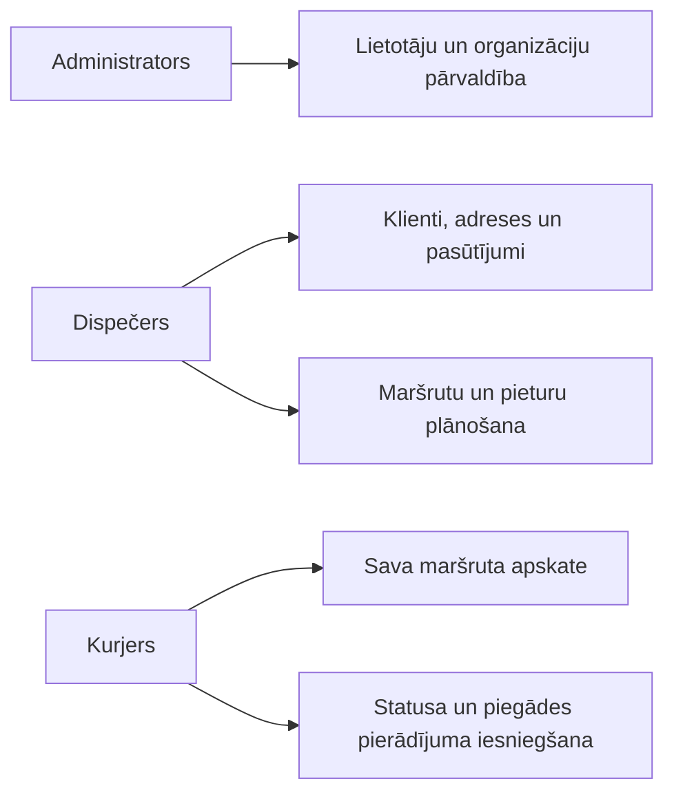

# Maršrutu plānotājs

Iekšēja loģistikas pārvaldības tīmekļa lietotne maziem un vidējiem piegādes uzņēmumiem. Sistēma vienuviet apvieno klientu, adrešu un pasūtījumu pārvaldību, kurjeru maršrutu plānošanu un piegāžu izpildes kontroli.

## Problēma un risinājums

Piegāžu plānošana izklājlapās un informācijas apmaiņa vairākos saziņas kanālos apgrūtina aktuālā pasūtījumu stāvokļa noteikšanu, palielina kļūdu risku un neļauj skaidri nodalīt dispečera un kurjera pienākumus.

Maršrutu plānotājs nodrošina:

- centralizētu klientu, adrešu, pasūtījumu un maršrutu datubāzi;
- maršrutu izveidi, pasūtījumu piešķiršanu un pieturu secības maiņu;
- kurjeram pielāgotu saskarni piegādes statusu atjaunināšanai;
- fotoattēla pievienošanu kā piegādes pierādījumu;
- meklēšanu, filtrēšanu, kārtošanu, statistikas kopsavilkumus un CSV eksportu;
- organizāciju datu nošķiršanu un piekļuves kontroli pēc lietotāja lomas.

## Lietotāju lomas

| Loma | Galvenās iespējas |
| --- | --- |
| Administrators | Pārvalda lietotājus un organizācijas, redz sistēmas kopsavilkumu un var strādāt ar visu organizāciju datiem. |
| Dispečers | Pārvalda savas organizācijas klientus, adreses un pasūtījumus; izveido maršrutus, piešķir kurjerus un sakārto pieturas. |
| Kurjers | Redz savus šodienas, gaidāmos un pabeigtos maršrutus; maina pieturu statusus un pievieno piegādes pierādījumus. |



## Funkcionalitāte

- Reģistrācija, pieslēdzoties esošai organizācijai ar kodu vai izveidojot jaunu organizāciju.
- Autentifikācija, profila un paroles pārvaldība ar Laravel Fortify.
- Klientu, adrešu un pasūtījumu izveide, apskate, labošana un dzēšana.
- Adrešu koordinātu iegūšana ar Nominatim un attēlošana OpenStreetMap kartē.
- Dienas maršruta izveide konkrētam kurjeram.
- Pasūtījumu pievienošana maršrutam un pieturu secības pārkārtošana.
- Pasūtījumu un maršrutu meklēšana, filtrēšana un kārtošana.
- Maršrutu un pasūtījumu CSV eksports, kā arī drukājama maršruta lapa.
- Piegādes statusi, neveiksmes iemesls un fotoattēls kā piegādes pierādījums.
- Administratora, dispečera un kurjera vadības paneļi ar aktuālo datu kopsavilkumu.
- Latviešu un angļu valodas saskarne, gaišais un tumšais režīms.

## Izmantotās tehnoloģijas

| Tehnoloģija | Lietojums un izvēles pamatojums |
| --- | --- |
| PHP 8.4+ | Servera puses loģika ar tipu deklarācijām un mūsdienīgām valodas iespējām. |
| Laravel 12 | MVC struktūra, Eloquent ORM, validācija, autorizācijas politikas, migrācijas un testēšanas rīki. |
| Laravel Fortify | Droša autentifikācijas un paroles pārvaldības pamatfunkcionalitāte. |
| Inertia.js 2 | Savieno Laravel servera maršrutus ar React saskarni bez atsevišķas REST API uzturēšanas. |
| React 19 un TypeScript | Komponentēs sadalīta, tipizēta un interaktīva lietotāja saskarne. |
| Tailwind CSS 4 | Adaptīvas un vienotas saskarnes veidošana. |
| Vite 7 | Frontend resursu izstrādes serveris un produkcijas būvēšana. |
| SQLite | Vienkārša lokālās izstrādes datubāze; Laravel konfigurācija ļauj pāriet arī uz citu SQL datubāzi. |
| Leaflet un OpenStreetMap | Maršruta pieturu vizualizācija kartē bez maksas kartes platformas licences. |
| Nominatim | Latvijas adrešu ģeokodēšana; rezultāti tiek glabāti kešatmiņā 30 dienas. |
| PHPUnit 11 | Automatizēti vienību un funkcionalitātes testi. |
| Laravel Pint, ESLint un Prettier | PHP, TypeScript un React koda kvalitātes un stila kontrole. |

## Sistēmas prasības

- PHP 8.4 vai jaunāks ar Laravel nepieciešamajiem paplašinājumiem;
- Composer;
- Node.js 20 vai jaunāks un npm;
- SQLite vai cita Laravel atbalstīta SQL datubāze;
- interneta savienojums kartes slāņu, Leaflet resursu un Nominatim ģeokodēšanas izmantošanai.

## Palaišana

1. Klonējiet repozitoriju un atveriet projekta mapi:

   ```bash
   git clone https://github.com/23DP1MRazz/marsrutu_planotajs
   cd my-app
   ```

2. Izpildiet automātisko uzstādīšanu:

   ```bash
   composer run setup
   ```

   Komanda instalē PHP un JavaScript atkarības, izveido `.env`, ģenerē lietotnes atslēgu, izpilda datubāzes migrācijas un uzbūvē frontend resursus.

3. Izveidojiet simbolisko saiti publiski pieejamiem piegādes pierādījumiem:

   ```bash
   php artisan storage:link
   ```

4. Izveidojiet sākotnējo administratoru:

   ```bash
   php artisan db:seed
   ```

   Noklusējuma pieslēgšanās dati:

   ```text
   E-pasts: admin@example.com
   Parole: password
   ```

   Pirms publiskas izvietošanas `.env` failā norādiet drošus `ADMIN_EMAIL`, `ADMIN_NAME` un `ADMIN_PASSWORD`, pēc tam vēlreiz izpildiet `php artisan db:seed`.

5. Palaidiet izstrādes vidi:

   ```bash
   composer run dev
   ```

6. Atveriet terminālī norādīto lokālo adresi, parasti `http://127.0.0.1:8000`.

### Manuāla uzstādīšana

```bash
composer install
cp .env.example .env
php artisan key:generate
php artisan migrate
npm install
php artisan storage:link
php artisan db:seed
composer run dev
```

Noklusējumā tiek lietota `database/database.sqlite` datubāze. Citas datubāzes pieslēgumu var iestatīt `.env` failā ar `DB_*` mainīgajiem.

### Ārējo pakalpojumu konfigurācija

Nominatim noklusējuma iestatījumi ir piemēroti Latvijas adresēm. Vajadzības gadījumā `.env` failā var mainīt:

```dotenv
NOMINATIM_URL=https://nominatim.openstreetmap.org/search
NOMINATIM_COUNTRYCODES=lv
```

## Datubāzes modelis

Lietotnes biznesa dati glabājas desmit savstarpēji saistītās tabulās: `users`, `organizations`, `dispatchers`, `couriers`, `clients`, `addresses`, `orders`, `routes`, `route_stops` un `proof_of_delivery`. Papildus Laravel izmanto sesiju, kešatmiņas un rindu tabulas.


Ārējās atslēgas, unikālie ierobežojumi un indeksi aizsargā datu integritāti. Piemēram, vienam kurjeram vienā organizācijā konkrētā datumā nevar izveidot divus maršrutus, bet vienai pieturai var būt tikai viens piegādes pierādījums.

## Drošība un OWASP

- paroles tiek jauktas ar Laravel drošo `hashed` pārveidojumu;
- veidlapām tiek nodrošināta CSRF aizsardzība;
- visi lietotāja ievaddati tiek pārbaudīti Form Request klasēs;
- Eloquent ORM un parametru piesaiste samazina SQL injekcijas risku;
- autorizācijas politikas un lomu pārbaudes ierobežo piekļuvi funkcijām;
- organizāciju dati tiek nošķirti, filtrējot vaicājumus pēc `organization_id`;
- augšupielādēm ir atļauti tikai attēli `jpg`, `jpeg`, `png` un `webp` līdz 5 MB;
- paroles maiņas pieprasījumiem ir ātruma ierobežojums;
- produkcijas vidē tiek prasīta vismaz 12 rakstzīmju sarežģīta un nekompromitēta parole;
- produkcijas vidē Laravel bloķē destruktīvas datubāzes komandas.

Drošība ir nepārtraukts process. Pirms produkcijas izvietošanas jālieto HTTPS, `APP_DEBUG=false`, droši vides mainīgie, regulāri atkarību atjauninājumi un drošības pārbaudes.

## Pieejamība un WCAG

Saskarnē izmantoti semantiski virsraksti, ievades lauku etiķetes, attēlu alternatīvie teksti, tastatūrai pieejami dialogi un vadīklas, redzami fokusa stāvokļi, adaptīvs izkārtojums un valodas atribūts dokumentam. Pieejams arī gaišais un tumšais režīms.

Pirms gala iesniegšanas ieteicams veikt manuālu tastatūras pārbaudi, kontrasta pārbaudi un auditu ar Lighthouse vai axe DevTools. README neapgalvo pilnu WCAG 2.2 atbilstību bez atsevišķa audita.

## PWA statuss

Pašlaik projektā nav tīmekļa lietotnes manifesta un service worker, tāpēc lietotne vēl nav pilnvērtīga PWA un nav instalējama darbam bezsaistē. Lai izpildītu PWA kritēriju, jāpievieno vismaz:

- `manifest.webmanifest` ar nosaukumu, ikonām, sākuma URL un attēlošanas režīmu;
- service worker statisko resursu kešošanai;
- manifesta un tēmas metadati HTML dokumentā;
- instalējamības un bezsaistes scenārija pārbaude ar Lighthouse.

## Testēšana

Projektā ir PHPUnit funkcionalitātes un vienību testi autentifikācijai, CRUD darbībām, lomām, organizāciju datu nošķiršanai, maršrutu plānošanai, kurjera darbplūsmai un ģeokodēšanai.

Palaist visus PHP testus:

```bash
php artisan test --compact
```

Palaist koda stila un frontend pārbaudes:

```bash
vendor/bin/pint --dirty
npm run types
npm run format:check
```

### Pieci galvenie testpiemēri

| Nr. | Testa scenārijs | Darbības | Sagaidāmais rezultāts |
| --- | --- | --- | --- |
| 1 | Lietotāja autentifikācija | Ievadīt derīgu un nederīgu e-pastu/paroli. | Derīgs lietotājs nonāk vadības panelī; nederīgi dati tiek noraidīti. |
| 2 | Pasūtījuma CRUD un validācija | Dispečers izveido, labo un dzēš pasūtījumu; ievada nederīgu laika logu. | Derīgi dati tiek saglabāti, CRUD darbības izdodas, bet beigu laiks pirms sākuma laika tiek noraidīts. |
| 3 | Organizāciju datu izolācija | Dispečers mēģina atvērt citas organizācijas pasūtījumu. | Sistēma atgriež `403 Forbidden`, un svešie dati netiek parādīti. |
| 4 | Maršruta plānošana | Dispečers izveido maršrutu, piešķir pasūtījumus un maina pieturu secību. | Tiek izveidots maršruts un pieturas; pasūtījumi iegūst piešķirtu statusu un jaunā secība tiek saglabāta. |
| 5 | Kurjera piegādes izpilde | Kurjers atjaunina savas pieturas statusu un augšupielādē atļauta formāta fotoattēlu. | Mainās pieturas, pasūtījuma un maršruta statuss; piegādes pierādījums tiek saglabāts un ir pieejams tikai autorizētiem lietotājiem. |

Automatizēto testu piemēri atrodas `tests/Feature/OrderCrudTest.php`, `tests/Feature/RoutePlanningTest.php`, `tests/Feature/CourierRouteTest.php`, `tests/Feature/OrganizationAuthorizationTest.php` un `tests/Unit/NominatimGeocoderTest.php`.

## Atbilstība noslēguma darba kritērijiem

| Kritērijs | Realizācija |
| --- | --- |
| Vismaz četras datubāzes tabulas | Izpildīts: biznesa modelī ir 10 savstarpēji saistītas tabulas. |
| Datubāzes integrācija un datu apmaiņa | Izpildīts ar Eloquent ORM, migrācijām un Inertia datu nodošanu. |
| Datu ievietošana, rediģēšana un dzēšana | Izpildīts klientiem, adresēm, pasūtījumiem un administrēšanas datiem. |
| Datu validācija | Izpildīta Form Request klasēs un datubāzes ierobežojumos. |
| Autentifikācija un lomas | Izpildīts administratoram, dispečeram un kurjeram. |
| Statistika un grupēti aprēķini | Vadības paneļos ir skaitītāji, gaidāmie maršruti un jaunākie ieraksti. |
| Kārtošana, filtrēšana un meklēšana | Izpildīta pasūtījumu, maršrutu un kurjera vēstures skatos. |
| Saistīto tabulu datu atlase | Izpildīta ar Eloquent relācijām un eager loading. |
| Mūsdienīgs, adaptīvs interfeiss | Izpildīts ar React, Tailwind CSS un mobilajam skatam pielāgotu kurjera saskarni. |
| OWASP | Galvenie aizsardzības pasākumi ir ieviesti; pirms produkcijas vajadzīgs drošības audits. |
| WCAG | Ieviesti pieejamības pamatelementi; pilnai atbilstībai vajadzīgs atsevišķs audits. |
| Vismaz pieci testpiemēri | Izpildīts; projektā ir plašāks automatizēto testu kopums un iepriekš aprakstīti pieci galvenie scenāriji. |
| PWA | Vēl nav izpildīts. Nepieciešams manifests un service worker. |
| README ar palaišanu un rīkiem | Izpildīts šajā dokumentā. |

## Projekta struktūra

```text
app/                 Laravel modeļi, kontrolieri, politikas, pieprasījumi un servisi
database/            Migrācijas, modeļu fabrikas, SQLite datubāze un sākumdati
resources/js/        React lapas, komponentes, tipi, tulkojumi un palīgfunkcijas
resources/css/       Tailwind un publiskās sākumlapas stili
routes/              Tīmekļa un iestatījumu maršruti
tests/               PHPUnit funkcionalitātes un vienību testi
```

## Licence

Projekts izstrādāts mācību noslēguma darbam.
